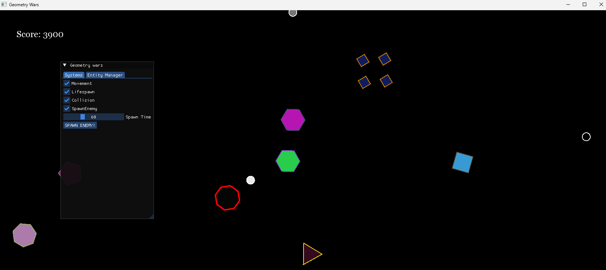
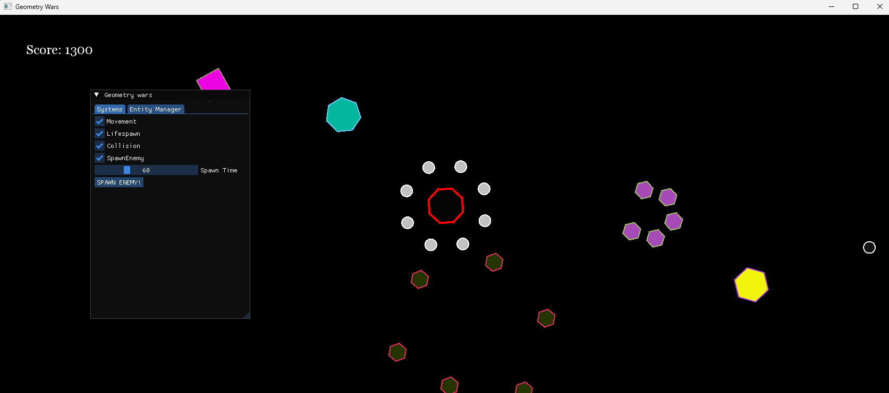
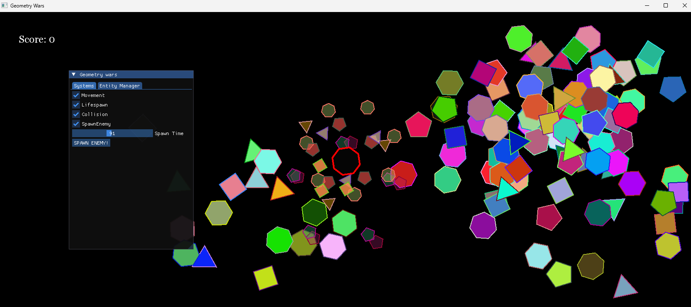

# Geometry Wars
In this thrilling and dynamic game, geometric shapes continuously appear on the screen, challenging the player to destroy them to earn points. Each shape moves at different speeds and bounces off the edges of the screen, adding to the chaotic and fast-paced environment.

## Gameplay:

### Player Movement: 
Navigate your player using the WASD keys to move in all directions.
### Shape Destruction: 
As the player, you must shoot and destroy various geometric shapes. When a shape is destroyed, it shatters into smaller pieces that also need to be dealt with.

###  Scoring System: 
Points are awarded based on the size of the destroyed shape. Larger shapes yield more points, while smaller ones contribute fewer points to the score.

###  Movement and Collision: 
The shapes move unpredictably, bouncing off the screen's edges, which requires the player to stay alert and strategic in their shooting.

###  Player Death: 
If the player collides with any of the shapes, they die, and their score is reset to zero. This adds an extra layer of difficulty, requiring careful maneuvering and timely attacks.

### Attacks:
- Regular Attack: 

Fire a single bullet using the left mouse button.
- Super Attack: 

Unleash a powerful super attack with the right mouse button. This ability can be used once every few seconds and is crucial for managing overwhelming waves of shapes.
## Visuals:

The game features a minimalist design with various colored geometric shapes set against a dark background.

An intuitive interface displays the score and includes settings for game systems and an entity manager, allowing for an immersive and customizable experience.
## Objectives:

###  Survival:
Maintain your focus and reflexes to destroy as many shapes as possible without letting them clutter the screen.

### High Score: 
Aim to achieve the highest score by efficiently destroying shapes, avoiding collisions, and making the best use of your super attack.

### Example of gameplay:

